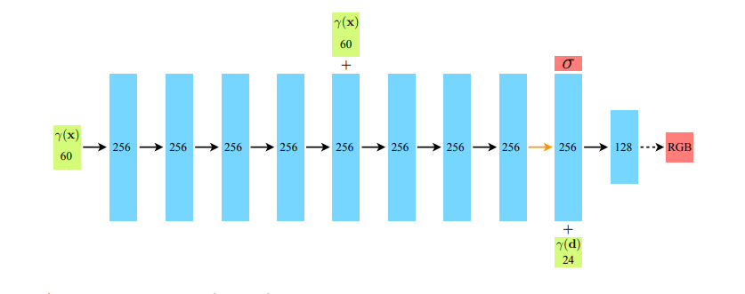

# NeRF or Nothing (CS 1430 Final Project)
This repository contains a reimplementation of "NeRF: Representing Scenes as Neural Radiance Fields for View Synthesis" in Pytorch. 

Authors: Ross Briden, John Fay, Daniela Wiepert 

# TODO
## Data
- [x] Support for ingesting Blender config files (necessary for synthetic data). Support for Blender data looks 
      significantly easier than support for LLFF data.
- [x] Suppose for ingesting LLFF config files (necessary for photos).
- [x] Each of the aforementioned formats need to return images, poses, a set of novel poses to render, and camera 
      intrinsic (height, width, focal length).

* Remark: It seems like some aspects of these loading functions are from the COLMAP 
or LLFF library? So, it's probably not entirely necessary to implement all of this 
  functionality from scratch. Our time might be better spent collecting data and modifying 
  it so that it's in the appropriate format. 

## Model 
- [x] Design a config format for input data.
- [x] Write a flag parser.   
- [x] Support for NDC rays (see p.19). This only matters when we're using LLFF data.
- [x] Decide which strategy to use for ray sampling. One strategy is to randomly select an input 
      image and then randomly select rays. Another strategy is to randomly sample rays from all possible 
      pixels in the dataset.
- [x] Write a function that computes the ray for each pixel in an image using camera intrinsics (height, width, focal length) and a pose.
- [x] Reimplement the MLP 9-layer MLP discussed in the paper (using high-frequency input encoding mentioned in paper; see architecture below.)
- [x] Write rendering function. 
- [x] Write loss function.
- [x] Ensure the fine and coarse networks are implemented as separate networks.  
- [x] Add Tensorboard support
- [x] Add support for random Gaussian noise during training (p. 17)

## Other 
- [x] Add requirements.txt file.

# Model Architecture 

